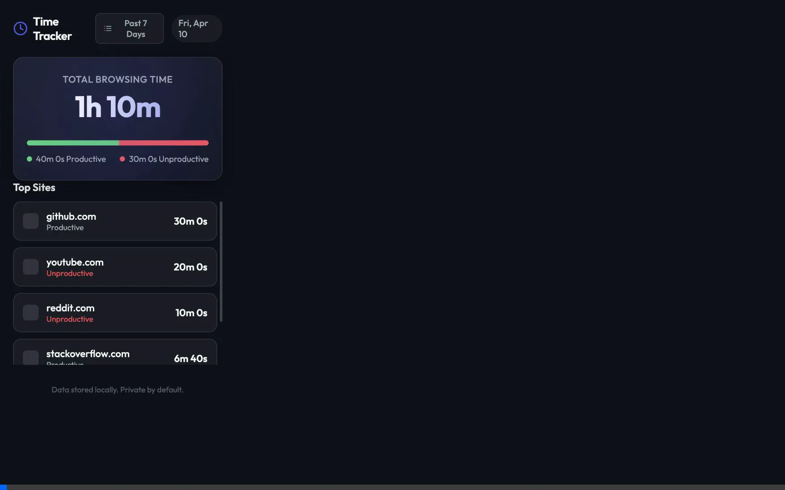

# Time Wasted Tracker

A modern, visually appealing Chrome extension that tracks how much time you spend on different websites and helps you visualize your browsing habits.

## Demo



## Features

- **Real-time Tracking:** Runs seamlessly in the background and precisely measures your time spent per website. tracking automatically pauses when you switch away from your browser or go idle.
- **Productivity Categorization:** Automatically categorizes sites into "Productive" or "Unproductive" categories to give you an overview of where your time goes.
- **Visual Dashboard:** An aesthetically pleasing popup with a gradient-rich interface, glassmorphism components, and simple progress visualizers.
- **Privacy First:** All data is stored purely locally within your browser (`chrome.storage.local`). No data is sent to external servers.

## Installation & Testing Locally

To run and test the extension directly in your browser, follow these steps:

1. Open Google Chrome.
2. Type `chrome://extensions/` into your address bar and press Enter.
3. In the top-right corner, toggle the **Developer mode** switch so that it is enabled.
4. Three new buttons will appear at the top-left of the page. Click **Load unpacked**.
5. A file browser dialog will open. Navigate to and select the directory containing this project code (where `manifest.json` is located): `{/pathtoProjectFolder}`.
6. Click **Select** (or **Open**). You should now see the extension installed in your list!

### To Use It:
- Click the puzzle piece icon () in the upper right-hand corner of Chrome. 
- Look for **Time Wasted Tracker** and click the pin icon next to it so it stays visible in your toolbar.
- Browse the web! Open different tabs, watch a video, switch domains.
- Click the Time Wasted Tracker icon in your toolbar to see your stats populate dynamically.

## Customization

You can customize which websites classify as "Unproductive". Simply open `utils.js` and edit the `UNPRODUCTIVE_DOMAINS` array to add or omit specific sites:
```js
export const UNPRODUCTIVE_DOMAINS = [
  'facebook.com',
  'twitter.com',
];
```
After making changes to any code, make sure to find the extension in `chrome://extensions/` and click the **Refresh** icon () on the extension card so the updates take effect.
